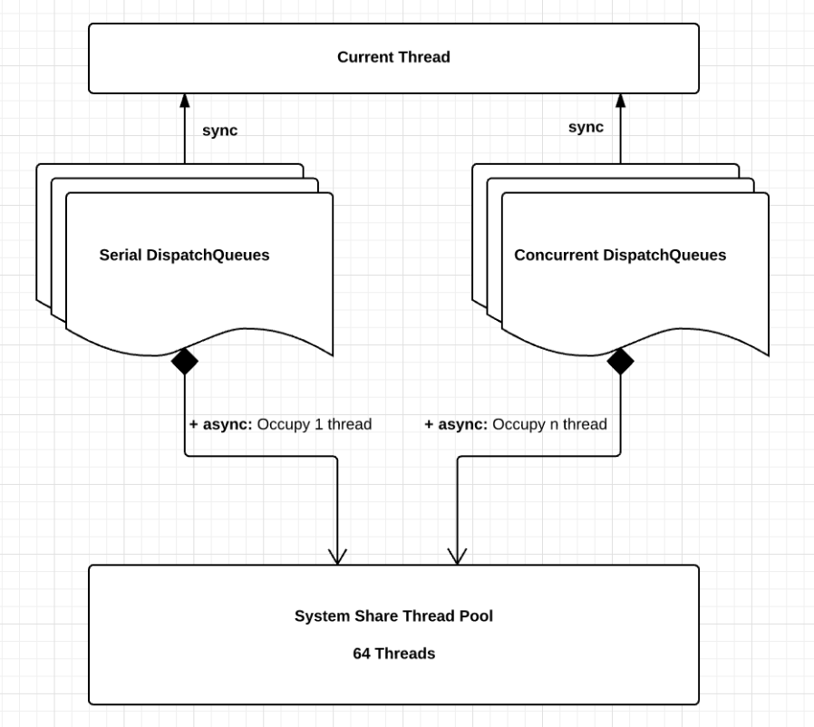
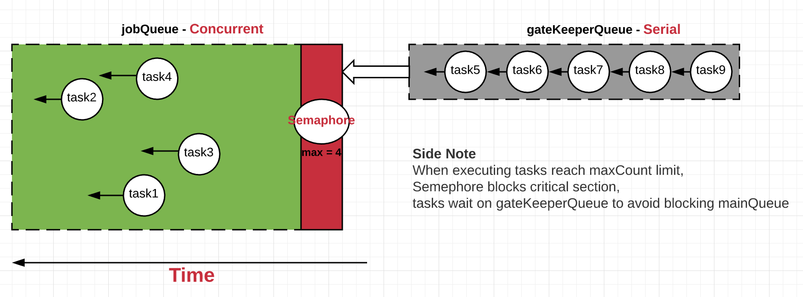

# CZDispatchQueue
 

### Summary
* Facade class encapsulating DispatchQueue
* Utilize DispatchSemaphore to fulfill the control of max concurrent executions
* Adopt two queues: Serial gateKeeperQueue and concurrent jobQueue, to ensure only one thread is blocked at most when waiting for semaphore signal
* Limit the number of concurrently executing blocks/items in a dispatch queue. Similar as maxConcurrentOperationCount on NSOperationQueue

### Screen Record 
Even we triggered 1000 asynchronous tasks in CZDispatchQueue, as we set maxConcurrentCount to 3, there should have 3 concurrent executions at maximum, other tasks will be queued until slots available. As in the below screenrecord, only 3 tasks are executing at a time:

### Motivation/Apple's DispatchQueue
On iOS, all DispatchQueues of one app share single thread pool with 64 threads, the resource is indeed limited, it's nice to make DispatchQueue more controllable.

### How gateKeeperQueue/jobQueue works?

